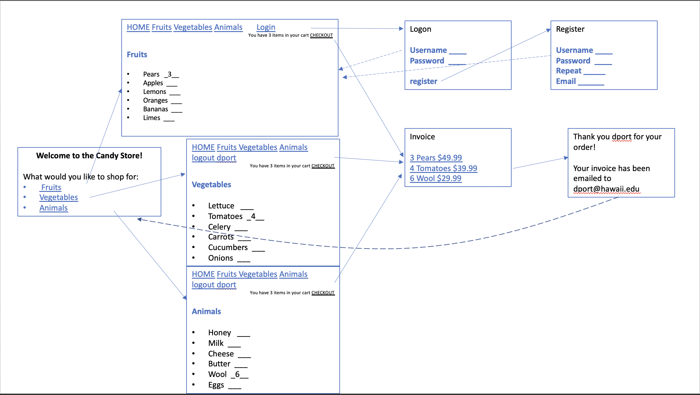

  <b>1. Show what each page will look like. The pages do not have to be “functional” but the design should clear.</b>
   
  

  
  <b>2.	 Describe your design for your site’s shopping cart. That is, will it be a separate page that the user can view and edit, or will it be integrated into the product pages? If so, describe in detail how this will work on your site. Provide several examples of using the cart.</b>
   
  
   
 My design for the cart will be an "invisible" cart. Users should be able to update the amount of items they want on the products display page and those items will be updated in their shopping cart. Instead of directing the user to a seperate page that shows the user their shopping cart, the invisible cart just notifies the user that their cart is updated. This way, the user won't have to press the back button to continue shopping.
   
  
   
  <b>3.	Explain specifically how you will use sessions to manage your shopping cart. In particular, what shopping cart data will be stored in the session, what data format will be used (NOT what data type, but the format like with the data format used for your registration data). Use code examples showing what data structures (such as arrays and their objects) you will use to manage the shopping cart data and how they will be used in a session.</b>
   
  
   
Sessions will be used to manage my shopping cart by saving user's sessions on the server so that when they log in again, they can access their session through a session ID. My data such as products, user information, and registration data will be formatted using objects and arrays in JSON format. An example of this would be the following:
       
    {
   
      "Fruits": [
     
        {
   
            "name": "1 Box of Pears",
   
            "price": 49.99,
   
            "image": "pear.jpeg",
   
            "quantity_available": 15
   
        },
   
        {
   
            "name": "1 Box of Apples",
   
            "price": 46.99,
   
            "image": "apple.jpeg",
   
            "quantity_available": 14
   
        },
   
        {
   
            "name": "1 Box of Lemons",
   
            "price": 43.99,
   
            "image": "lemon.png",
   
            "quantity_available": 16
   
        }
   
     ]
   
  }

  
  <b>4.	How will you avoid access to your application when the user has not logged in or registered? What are the particular security concerns you must address?</b>
   
  Users will login with their username and cookie. From there, the server will be able to match the correct session ID to the correct user. If the log in is not successful, they will not be able to access other user's sessions. Some security concerns would be the handling of sensitive information such as passwords. To increase security, it would be beneficial to encrypt this information.
   
  <b>5.	Upon a successful login, how do you provide personalization in your UI? Explain how you did or will do this?</b>
   
      Upon successful login, I plan to incorporate personalization in my UI by including the user's email (username) at the top of the page. I will do this by accessing the data by using cookies and sessions. Once a user is properly identified, I can use their username to personalize a page.
   
  <b>6.	If you are working with partners, how will you split up the work in your team so that you are working in parallel as effectively as possible? That is, who is doing what and when?</b>
   
  I am currently working on this assignment on my own. I do not have any partners for this project.
   
  <b>7.	How are you approaching Assignment 3 differently than Assignment 2?</b>
   
  There are a lot of decisions to make in Assignment 3 compared to Assignment 2. Because there are so many choices, it can be easy to get overwhelmed. To try to avoid as much confusion as possible, I will try to put more thought into planning the structure of how I want my website to look and what I want it to do and how to be execute it.
